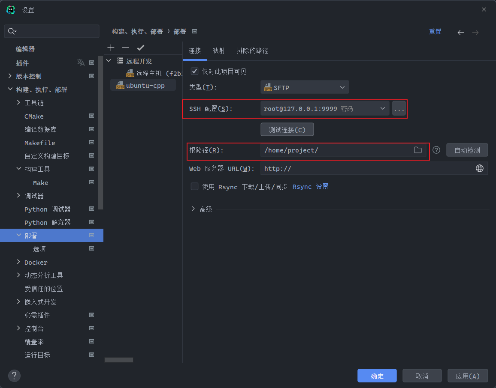

# 前言

对于C/C++的开发，生产环境往往都离不开Linux，开发环境在Windows而言，可以通过远程连接到Linux从而实现远程开发，本文章将会以Ubuntu为例，实现Clion远程连接Ubuntu


# 1.Ubuntu环境的准备
Clion可以通过ssh连接Linux环境，所以我们需要在服务器搭建好ssh环境
> docker可以通过暴露ssh服务端口实现连接

## 1.1 开启docker
如果是想要远程连接到docker容器，则需要容器暴露ssh服务端口
> ssh服务默认的运行端口是Linux的22端口，但可以更改，下文会提到
```sh
# 新建容器
docker run -it --name=<容器名称> -p <暴露端口>

# 具体例子
docker run -it --name=ubuntu-cpp -p 9999:22 ubuntu:22.04
```
> 对于-p参数，其格式为 `主机(宿主)端口:容器端口`，
> <br>也就是说，上述的例子会将容器的22端口映射到主机的9999端口
> <br>对于访问主机的9999端口，即会访问到容器的22端口(ssh服务端口)

<br>

## 1.2 安装启动ssh服务
* 首先，开启ssh服务需要下载openssh-server包
> 通过apt下载之前，建议换国内源
```sh
apt update
apt install -y openssh-server passwd
```

* 启动ssh服务，并将其设为开机自启
    * 对于非docker，可以手机用systemctl
    ```sh
    systemctl start sshd
    systemctl enable sshd
    ```
    * 对于docker容器，`systemctl`命令可能无法使用，就需要用到`service`命令
    ```sh
    # 开启ssh服务
    service ssh start
    # 通过写入/etc/profile.d/目录实现开机自启
    echo "service ssh start" > /etc/profile.d/ssh.sh
    ```

* 查看ssh服务的状态
```sh
# 非docker
systemctl status sshd

# docker
service ssh status
```
* docker容器还需要初始化用户密码
```sh
# 如果使用root用户连接，则需要修改root用户的密码
# 用什么用户连接就修改什么用户的密码
passwd root
```
<br>

## 1.3 配置ssh服务 
> ssh服务的配置文件在/etc/ssh/sshd_config

```sh
# 备份配置文件
cp /etc/ssh/sshd_config /etc/ssh/sshd_config.bak
# 修改配置文件
vim /etc/ssh/sshd_config
```

* 下面是一些ssh配置文件中的参数及其解释
> 对于ssh的配置文件可以按需修改，不需要可以不用修改

参数|解释
:--:|--
Port|ssh服务端口，默认为`22`
ListenAddress|ssh服务的监听IP，默认为`0.0.0.0`
MaxAuthTries|最大密码尝试数，默认为`6`
MaxSessions|最大终端数，默认为`10`
PermitEmptyPasswords|允许空密码登录，默认为`no`
PermitRootLogin|允许root用户登录

* 注意！在配置文件末尾添加一行`PermitRootLogin yes`，表示可以通过root用户登录

<br>

> 修改完配置文件需要重启ssh服务，配置才会生效
```sh
# 非docker
systemctl restart sshd

# docker
service ssh restart
```

# 2.Clion连接
在前面把环境搭建好了，就可以使用Clion进行远程开发了

## 2.1 配置Toolchains(工具链)

* 打开 `文件` -> `⚙️设置` -> `构建、执行、部署` -> `工具链`


* 点击 `凭据` 后面的 `⚙`


* 填写主机IP，端口和登录用户的账号密码
> 请注意，如果是docker，填写的端口为容器映射到主机的端口


* 我这里用的是本地docker，连接成功✅


<br>

## 2.2 使用Toolchains(工具链)

* 打开 `文件` -> `⚙️设置` -> `构建、执行、部署` -> `CMake`

* 添加配置，工具链使用刚才配置好的


* 切换运行环境


* 运行一段代码，发现已经连接成功
> 在运行代码的时候，会从本地同步一份代码文件到Linux中编译运行，再把结果返回到本地


<br>

# 3 通过SFTP同步代码
通过配置SFTP，可以使本地代码同步到远程开发环境

* 打开 `文件` -> `⚙️设置` -> `构建、执行、部署` -> `部署`

* 添加SFTP


<br>

* 填写配置
* 使用`Rsync`之后，在Linux下载安装的库是可以被本地Clion识别引用的
> 注意，此时在`部署`中还有一个SFTP，这个SFTP是与远程编译有关的的



* 打开 `文件` -> `⚙️设置` -> `构建、执行、部署` -> `部署` -> `选项` 
* 设置自动同步，将`从不`改为`始终`


<br>

# 结尾

至此，就配置完成了，可以快乐的在Clion写代码了😉